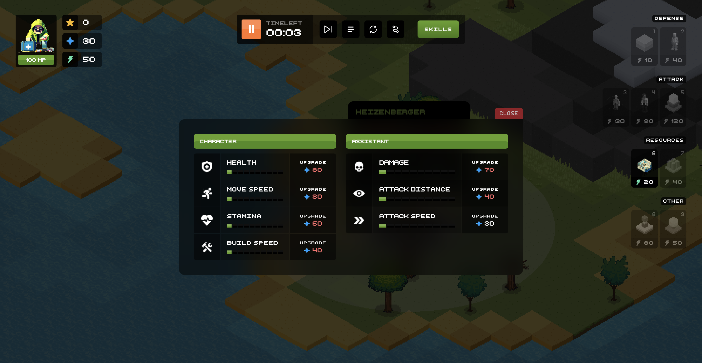

 🟨 _After version 1.18.5, development has been moved to the private repository._

## [DealerWave](https://medicinestorewave.vercel.app/)

Your task is to survive on chosen planet as many waves as possible. 
With each wave count of drugbot enemies and their characteristics will grow.

Build walls to defend, dealer towers to attack, ammunitions to reload towers and labs to get more resources.

And also upgrade skills of your character and his assistant first aid bag.

If you play in hard mode, you can earn SOBR tokens, which can be spent in various places afterwards.

**Join Discord - https://discord.gg/VXptmyVK**

## 🎮 [PLAY NOW](https://medicinestorewave.vercel.app/)

.

|  |  |  |  |
|---|---|---|---|
